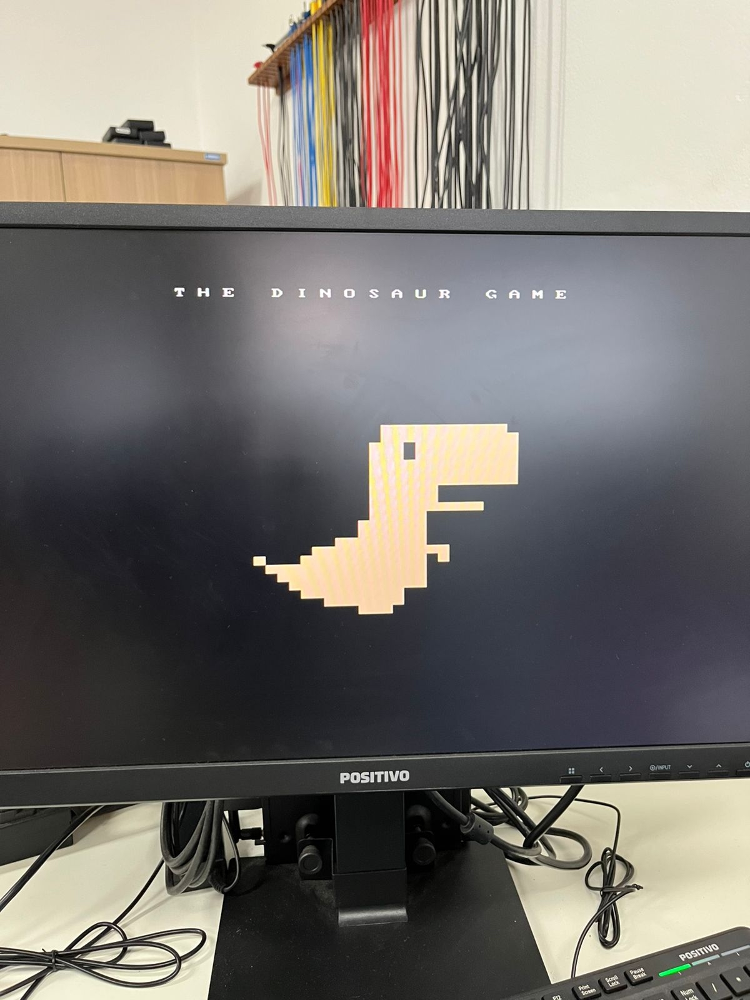
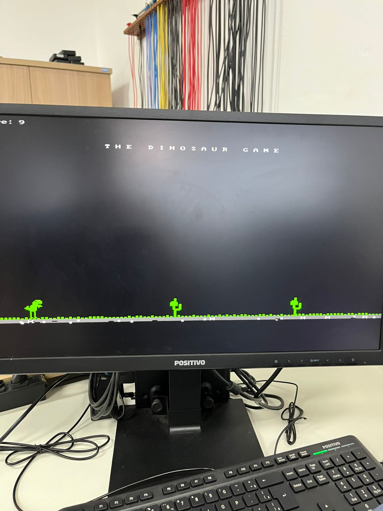
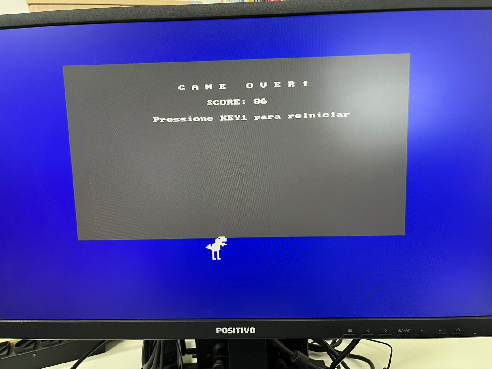

# T-Rex-Game-FPGA

## Informações do Projeto

|               |                                         |
| :------------ | :-------------------------------------- |
| **Matéria:** | Projeto de Sistemas Computacionais Embarcados                                   |
| **Professor:** | Dr. Emerson Carlos Pedrino                                                    |
| **Grupo:** | Gabriel Andreazi Bertho - RA 790780 e Caroline Elisa Duarte de Souza - RA 795565  |
| **Universidade:** | Universidade Federal de São Carlos                                         |

---

## 1. Visão Geral do Projeto

Este projeto consiste na implementação de um jogo 2D, inspirado no famoso "T-Rex Game" do Google Chrome, utilizando a saída de vídeo RGB da placa FPGA DE10-Standard. O desenvolvimento foi realizado em linguagem C para o processador **ARM Cortex-A9** embarcado no SoC (System-on-Chip) da placa.

O objetivo principal foi aplicar os conhecimentos sobre sistemas embarcados, programação de baixo nível e interação com periféricos de hardware. Para isso, foi utilizado o **Intel FPGA Monitor Program**, um ambiente de desenvolvimento que permite compilar, carregar e depurar programas C/Assembly para o processador ARM da placa DE10-Standard. O projeto foi baseado na Questão 02 da Prova 2, que propunha a adaptação do código de exemplo de saída de vídeo ("Video Out") do manual *DE10-Standard Computer System*.

O jogo finalizado inclui:
- Movimentação e pulo do dinossauro.
- Geração procedural de obstáculos (cactos).
- Sistema de pontuação e aumento de velocidade progressivo.
- Inimigos aéreos (pássaros) que aparecem após uma certa pontuação.
- Ciclo de dia e noite, que se alterna conforme a pontuação aumenta.
- Telas de início, jogo e "Game Over".

---
## 2. Estrutura e Funcionamento do Código (`video.c`)

O coração do projeto está no arquivo `video.c`. Ele é responsável por toda a lógica do jogo, renderização gráfica e interação com o hardware da placa. A seguir, uma explicação detalhada de seus componentes essenciais.

### 2.1. Inicialização e Mapeamento de Hardware

No início do código, são incluídas as bibliotecas e o arquivo `address_map_arm.h`. Este header é crucial, pois define os endereços de memória dos periféricos da placa, como:
- `PIXEL_BUF_CTRL_BASE`: Controlador do buffer de pixels da VGA.
- `FPGA_CHAR_BASE`: Buffer de caracteres para texto na tela.
- `KEY_BASE`: Endereço para leitura das chaves (botões) da placa.
- `RGB_RESAMPLER_BASE`: Resampler para a saída de vídeo RGB.

A função `main` inicia o programa configurando o ambiente:
1.  **Obtém a Resolução da Tela:** Lê os registradores do controlador de vídeo para determinar a resolução (`screen_x`, `screen_y`).
2.  **Configura a Profundidade de Cor:** Verifica a configuração do Resampler RGB para ajustar a formatação das cores.
3.  **Inicializa o Gerador de Números Aleatórios:** A função `srand(42)` é chamada para garantir que a geração de obstáculos seja consistente entre as execuções.

### 2.2. O Loop Principal do Jogo

O jogo opera dentro de um loop infinito (`while (1)`), que permite que o jogo seja reiniciado após o "Game Over". Dentro deste, existe o loop de gameplay principal (`while (!game_over)`).

```c
// Estrutura principal em main()
while (1) {
    // 1. Tela de Início
    // Exibe o logo e o título, aguarda o jogador pressionar KEY1

    while (!game_over) {
        // 2. Loop de Gameplay
        // Atualiza a lógica, renderiza os frames, verifica colisões
    }

    // 3. Tela de Game Over
    // Exibe a pontuação final e a mensagem para reiniciar
}
```

### 2.3. Lógica de Renderização Gráfica

A renderização não utiliza uma biblioteca gráfica tradicional. Em vez disso, as funções de desenho escrevem diretamente na memória de vídeo da FPGA.

-   **`video_box(x1, y1, x2, y2, color)`**: Função de baixo nível mais importante. Ela desenha um retângulo preenchido na tela, escrevendo um valor de cor (`short pixel_color`) para cada pixel dentro das coordenadas especificadas no buffer de pixels. 
-   **Sprites e Bitmaps**: Personagens como o dinossauro (`draw_dino`), cactos (`draw_obstacle`), pássaros (`draw_bird`) e o logo inicial (`draw_logo`) são desenhados a partir de matrizes `const unsigned char` (bitmaps).  Cada `1` na matriz representa um pixel a ser desenhado pela função `video_box`.  O movimento dos sprites é simulado alternando entre dois bitmaps (ex: `dino1` e `dino2`) a cada `N` frames. 

    ```c
    // Exemplo de bitmap do dinossauro
    const unsigned char dino1[20][16] = {
        {0,0,0,0,0,0,0,0,1,1,1,1,0,0,0,0},
        {0,0,0,0,0,0,0,1,0,1,1,1,1,0,0,0},
        // ... (restante do bitmap)
    };

    // Função de desenho percorre o bitmap
    void draw_dino(...) {
        for (row = 0; row < 20; row++) {
            for (col = 0; col < 16; col++) {
                if (dino_bitmap[row][col] == 1) {
                    video_box(x + col, y + row, x + col, y + row, color);
                }
            }
        }
    }
    ```

-   **Geração Procedural**: Elementos como o chão (`draw_ground`), nuvens (`draw_cloud`), estrelas (`draw_stars`), sol (`draw_sun`) e lua (`draw_moon`) são desenhados proceduralmente, usando a função `video_box` e números aleatórios para criar variedade e uma aparência mais orgânica. 

### 2.4. Lógica do Jogo e Interação

-   **Controle do Jogador**: O pulo do dinossauro é ativado pela leitura direta do registrador `KEY_BASE`.  Se o botão `KEY0` é pressionado (`(*key_ptr & 0x1) != 0`), a variável de estado `dino_jump_state` é alterada, iniciando a animação de pulo, que segue uma trajetória parabólica simples gerenciada pelo `jump_counter`. 

-   **Movimento dos Obstáculos**: Os obstáculos e pássaros se movem da direita para a esquerda.  Suas posições (`obstacle_x`, `bird_x`) são decrementadas a cada frame pela variável `current_speed`.  Quando um obstáculo sai da tela, sua posição é reiniciada para a direita, fora da tela, com uma distância aleatória, criando um fluxo infinito de desafios. 

-   **Detecção de Colisão**: A função `check_collision` implementa uma detecção de colisão baseada em *Bounding Box* (AABB - Axis-Aligned Bounding Box).  Ela verifica se os retângulos que envolvem o dinossauro e os obstáculos se sobrepõem. 

-   **Pontuação e Dificuldade**: A pontuação (`score`) é incrementada com base no `frame_counter`.  A velocidade do jogo (`current_speed`) aumenta gradualmente conforme a pontuação sobe, tornando o desafio progressivamente mais difícil. 

-   **Ciclo Dia/Noite**: A variável `night_mode` é alternada com base na pontuação (`(score / 50) % 2`).  Quando ativada, as funções de desenho utilizam uma paleta de cores diferente: o fundo fica escuro, o sol é substituído pela lua e estrelas aparecem no céu. 

### 2.5. Telas e Interface

-   **Tela de Início**: Exibe um logo estilizado (desenhado com `draw_logo`), o título do jogo e aguarda o jogador pressionar `KEY1` para iniciar a partida. 

    

-   **Gameplay**: Renderiza o jogo em tempo real. A pontuação é exibida no canto superior esquerdo usando a função `video_text`, que escreve caracteres no buffer de texto da FPGA. 

    

-   **Tela de "Game Over"**: Quando ocorre uma colisão, o loop de gameplay é interrompido.  A tela é limpa e uma caixa de diálogo é desenhada, mostrando a mensagem "GAME OVER!", a pontuação final e a instrução para reiniciar o jogo pressionando `KEY1`. 

    

---

## 3. Como Compilar e Executar

Para compilar e rodar este projeto, é necessário o ambiente de desenvolvimento da Intel para a placa DE10-Standard.

### 3.1. Pré-requisitos

-   **Hardware**:
    -   Placa Terasic DE10-Standard. 
    -   Cabo USB-Blaster para conexão com o PC.
    -   Monitor com entrada VGA.
    -   Fonte de alimentação para a placa.

-   **Software**:
    -   **Intel Quartus Prime Lite Edition 18.1**.
    -   **Intel FPGA Monitor Program 18.1**.
    -   *Observação Importante*: O Monitor Program deve ser instalado no mesmo diretório raiz do Quartus Prime para que as ferramentas de compilação cruzada para ARM (`arm-altera-eabi-gcc`) sejam encontradas corretamente.

### 3.2. Passos para Execução

1.  **Conecte o Hardware**: Conecte a placa DE10-Standard ao computador via cabo USB, ligue a fonte de alimentação e conecte o monitor à porta VGA.

2.  **Abra o Projeto no Monitor Program**:
    -   Inicie o `Intel FPGA Monitor Program`.
    -   Vá em `File > Open Project...`.
    -   Selecione o arquivo `Projeto1.amp`. Este arquivo contém todas as configurações do projeto, como a arquitetura do processador (`ARM Cortex-A9` ), a placa alvo (`DE10-Standard` ), os arquivos fonte  e as configurações do linker.

3.  **Compile o Código**:
    -   No Monitor Program, certifique-se de que o painel "Program" está visível.
    -   Clique no ícone de compilação (que se assemelha a uma engrenagem ou martelo) ou vá em `Actions > Compile`.
    -   O Monitor Program usará o `makefile` fornecido para invocar o compilador `arm-altera-eabi-gcc` com as flags especificadas (`-g -O1`). 
    -   Este processo irá gerar os arquivos objeto (`.o`), e finalmente, o arquivo executável `video.axf` e o arquivo de imagem de memória no formato SREC, `video.srec`.

4.  **Carregue e Execute o Programa**:
    -   Após a compilação bem-sucedida, clique no ícone de "Download" (seta para baixo) ou vá em `Actions > Load`.
    -   O Monitor Program irá carregar o arquivo `video.srec` para a memória DDR3 da placa, nos endereços base especificados no arquivo de projeto (`0x00000000`).
    -   Após o carregamento, o programa começará a ser executado automaticamente. A tela de início do jogo deverá aparecer no monitor VGA.

5.  **Jogar**:
    -   Pressione o botão `KEY1` na placa para iniciar o jogo. 
    -   Pressione o botão `KEY0` para fazer o dinossauro pular. 

### 3.3. Limpando os Arquivos de Build

Para remover todos os arquivos gerados durante a compilação (`.o`, `.axf`, `.srec`), você pode usar o comando `make CLEAN` no terminal, ou usar a opção de limpeza (`Actions > Clean`) no Monitor Program.